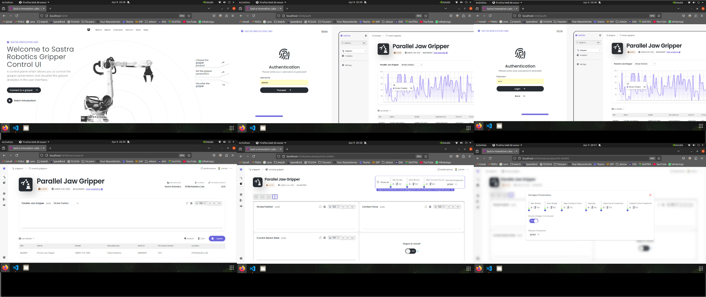
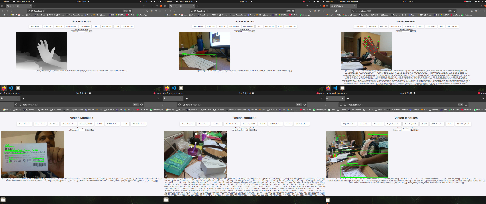

# 🤖 Gripper System

This project powers a smart, modular robotic gripper system built for **Sastra Robotics' SAR05 Parallel Jaw Gripper**. Designed with a focus on **real-time control**, **vision-guided intelligence**, and **intuitive web interaction**, it seamlessly integrates robotic feedback, camera input, and AI-driven perception.

---

## 📊 Architecture Diagram

---

## 🧠 System Highlights

- **Modular Node-Based Architecture**  
  Each subsystem — from motor control to AI vision — runs independently for easy scaling and debugging.

- **Smart Gripper Control**  
  Real-time serial communication ensures responsive, accurate finger movement with feedback monitoring.

- **Integrated Depth & RGB Vision**  
  Uses Intel RealSense for high-fidelity visual input to inform AI decisions and spatial awareness.

- **AI-Powered Perception**  
  Supports a suite of vision modules, including:
  - **YOLO & GroundingDINO** for object detection
  - **MiDaS** for depth estimation
  - **MobileSAM** for segmentation
  - **LLaVA** for visual question-answering
  - **PaddleOCR** for text recognition
  - **Hand/Human Pose Estimators**
  - **OWL-ViT** for zero-shot object detection

- **Web-Based UI**  
  Built using Angular and Flask, the UI provides an intuitive interface to control the gripper, visualize camera feeds, and interact with AI modules — all from a browser.

---

## 🖥️ Interfaces

- **Main UI Dashboard**  
  Full control and monitoring of the gripper system, from anywhere on the local network.

- **Vision Interface**  
  Local web view to monitor and interact with AI-driven vision modules in real time.

---

## 📷 Screenshots

### Main Control Dashboard  

### Vision Module Interface  

---

## 🧩 Designed for Developers

While the system is built for plug-and-play operation, developers and researchers can easily extend it. Whether you're swapping out AI models, integrating new sensors, or adjusting control logic — the modular design keeps things flexible and maintainable.

## 🛠️ Developer
- **Author**: Kaivalya Shah
- **Contact**: kaivalyashah192@gmail.com